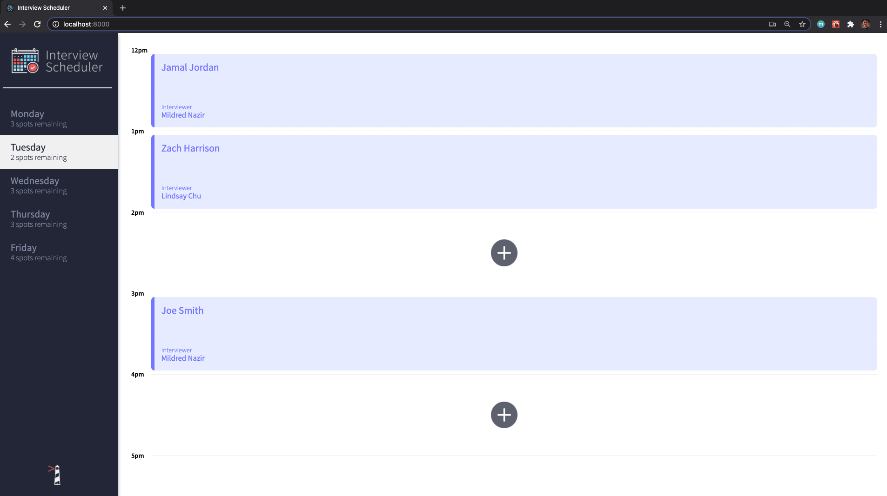

# Interview Scheduler
Interview Scheduler is a single page React application. It was designed to learn the fundamentals of building functional components with React.

## Setup

Install dependencies with `npm install`.

## Running Webpack Development Server

```sh
npm start
```

## Running Jest Test Framework

```sh
npm test
```

## Running Storybook Visual Testbed

```sh
npm run storybook
```

## Features include
- A user can create, read, update, and delete appointments from the user interface.
- When a user adds an interview they can type their name and select an interviewer from a given list of available staff.
- Data is persisted to the database once an appointment is saved successfully.

## Screenshots

